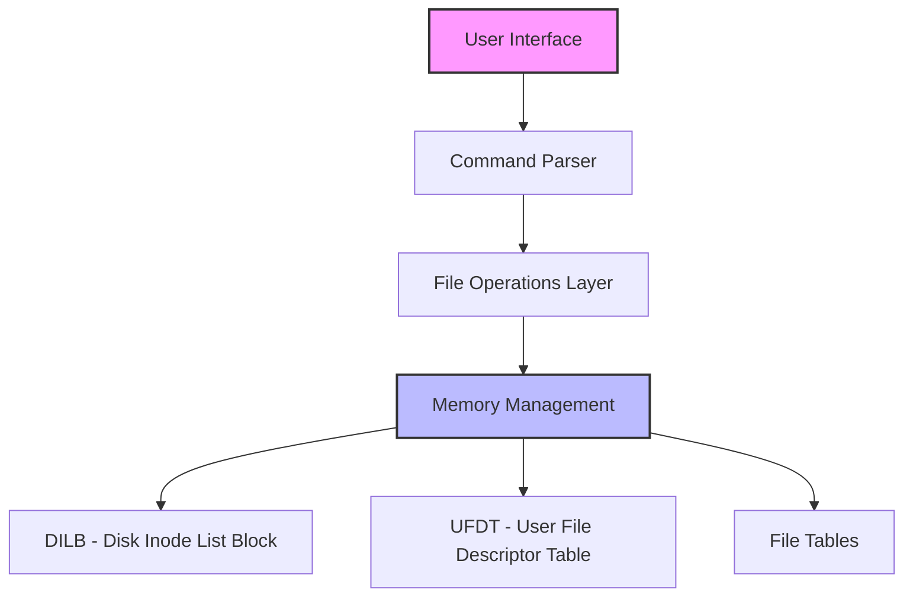
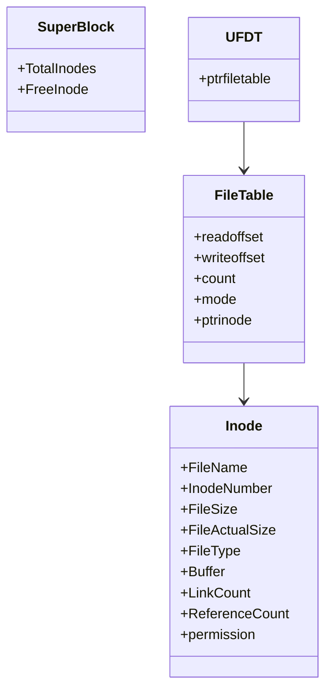

# Virtual File System (VFS)

A customized Virtual File System that emulates Unix/Linux file system functionalities. This project implements a file subsystem that provides various file operations like create, open, close, read, write, etc.

## Table of Contents
- [Overview](#overview)
- [System Architecture](#system-architecture)
- [Features](#features)
- [Getting Started](#getting-started)
- [Usage Examples](#usage-examples)
- [Contributing](#contributing)
- [Code Structure](#code-structure)

## Overview

The Virtual File System (VFS) is an in-memory file system that provides a layer of abstraction over the actual file system. It implements core file operations and maintains file metadata similar to the UNIX file system.

## System Architecture



Key Components:
- **DILB (Disk Inode List Block)**: Maintains file metadata
- **UFDT (User File Descriptor Table)**: Manages file descriptors
- **File Tables**: Handles file operations and permissions
- **Memory Management**: Controls file data in memory

## Features

- File Operations:
  - Create new files
  - Open existing files
  - Read file content
  - Write to files
  - Delete files
  - List all files
  - Get file information
  - Truncate files
- Permission Management (Read/Write)
- File Descriptor Management
- Maximum file size: 2048 bytes
- Support for up to 50 files

## Getting Started

### Prerequisites
- C++ compiler (GCC recommended)
- Make utility (optional)

### Building the Project

```bash
# Compile the source code
g++ VirtualFileSystem.cpp -o vfs

# Run the application
./vfs
```

## Usage Examples

### 1. Create a new file
```bash
Marvellous VFS :> create Demo.txt 3
File is successfully created with file descriptor: 0
```

### 2. Write to file
```bash
Marvellous VFS :> write Demo.txt
Enter the data:
Hello, Virtual File System!
```

### 3. Read from file
```bash
Marvellous VFS :> read Demo.txt 50
Hello, Virtual File System!
```

### 4. List all files
```bash
Marvellous VFS :> ls
File Name        inode number     File size        Link count
--------------------------------------------------
Demo.txt         1               23               1
Test.txt         2               45               1
--------------------------------------------------
```

### 5. Get file information
```bash
Marvellous VFS :> stat Demo.txt
Statistical Information about file
File name: Demo.txt
Inode Number: 1
File size: 2048
Actual File size: 23
Link count: 1
Reference count: 1
File Permission: Read & Write
```

### 6. Delete file
```bash
Marvellous VFS :> rm Demo.txt
File successfully deleted
```

## Command Reference

| Command | Description | Usage |
|---------|-------------|-------|
| create | Create new file | `create <filename> <permission>` |
| write | Write to file | `write <filename>` |
| read | Read from file | `read <filename> <bytes>` |
| ls | List all files | `ls` |
| stat | File information | `stat <filename>` |
| fstat | File information using FD | `fstat <FD>` |
| truncate | Clear file data | `truncate <filename>` |
| rm | Delete file | `rm <filename>` |
| close | Close file | `close <filename>` |
| closeall | Close all files | `closeall` |
| help | Display commands | `help` |

## Code Structure



## Contributing

We welcome contributions! Here's how you can help:

1. Fork the repository
2. Create a new branch (`git checkout -b feature/improvement`)
3. Make your changes
4. Run tests to ensure everything works
5. Commit your changes (`git commit -m 'Add some feature'`)
6. Push to the branch (`git push origin feature/improvement`)
7. Create a Pull Request

### Areas for Contribution

1. **Feature Enhancement**
   - Add support for directories
   - Implement file system permissions
   - Add file system journaling
   - Improve error handling

2. **Code Optimization**
   - Memory usage optimization
   - Performance improvements
   - Code refactoring

3. **Documentation**
   - Improve code comments
   - Add more usage examples
   - Create detailed API documentation

4. **Testing**
   - Add unit tests
   - Create integration tests
   - Add stress testing

### Development Guidelines

1. Follow the existing code style
2. Add comments for new functions
3. Update documentation for changes
4. Test thoroughly before submitting PR
5. Keep commits atomic and well-described

### Setting Up Development Environment

1. Clone the repository
```bash
git clone https://github.com/yourusername/vfs.git
cd vfs
```

2. Create a new branch
```bash
git checkout -b feature/your-feature
```

3. Make your changes and test them

4. Submit a pull request with a clear description of changes

Remember to:
- Follow coding standards
- Write clear commit messages
- Update documentation
- Add tests for new features
